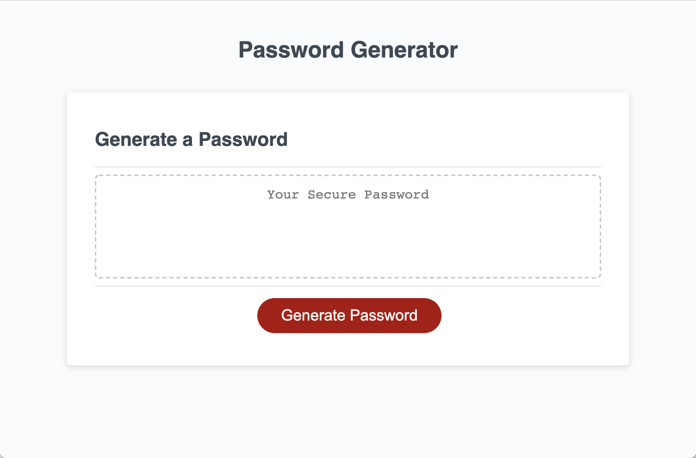

# password-generator

[Link to deployed application:](http://matthewxgoad.github.io/password-generator/)

## Description
This application generates a randomized password based on user inputs for length and character types.

## Credits
This application was coded by Matthew Goad as a requirement for the Washington University Coding Bootcamp. More of his work can be found [here](http://matthewxgoad.github.io/mgoad-portfolio/).